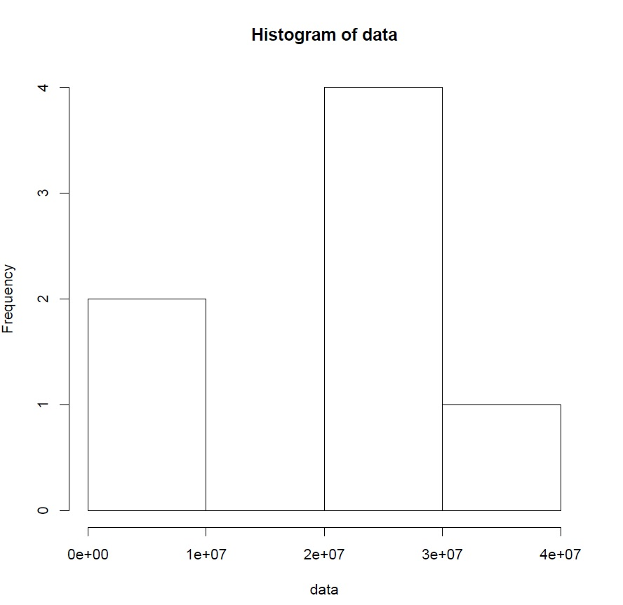
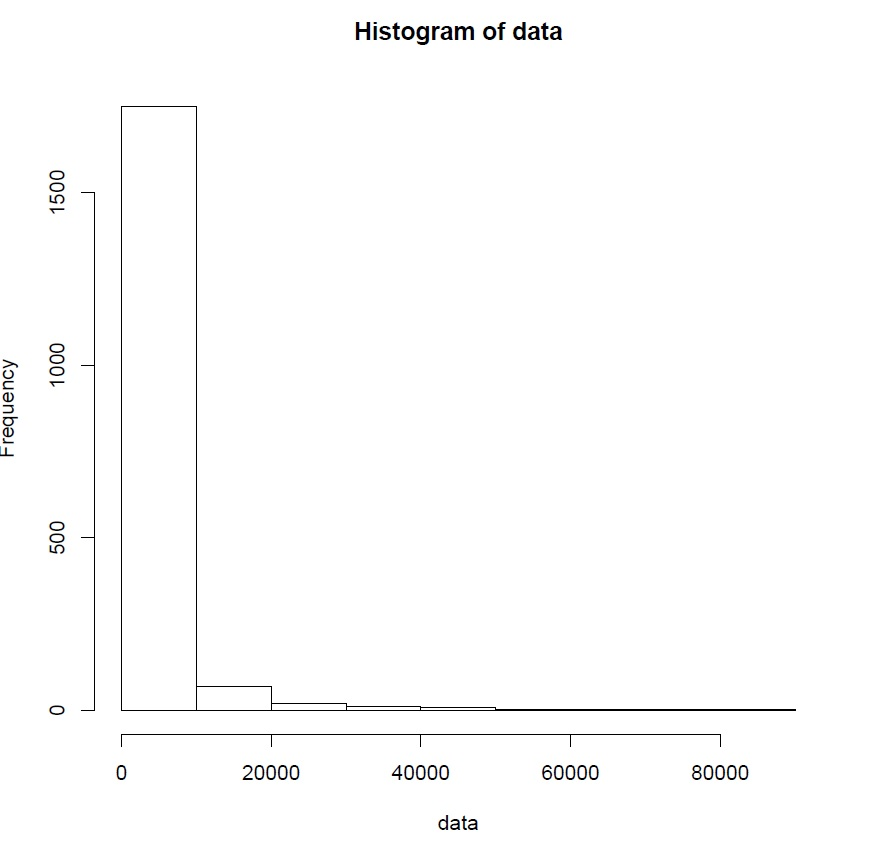
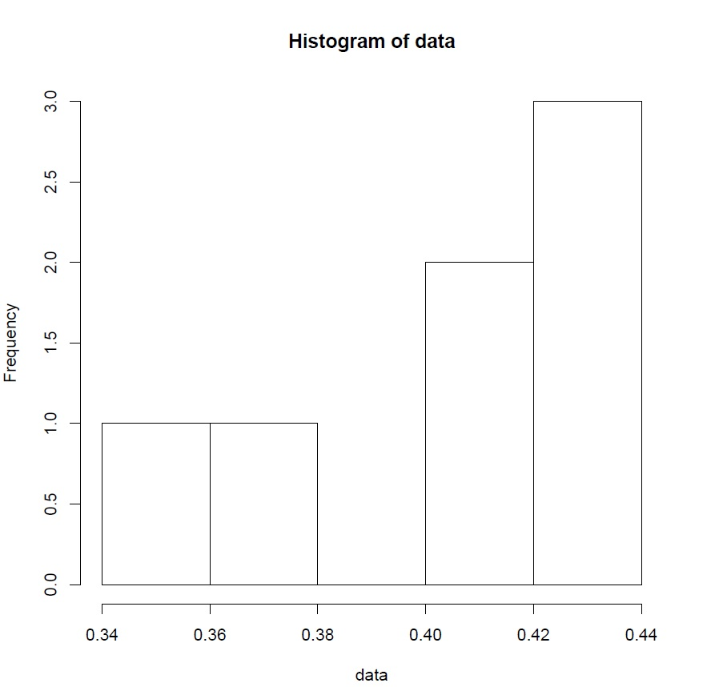
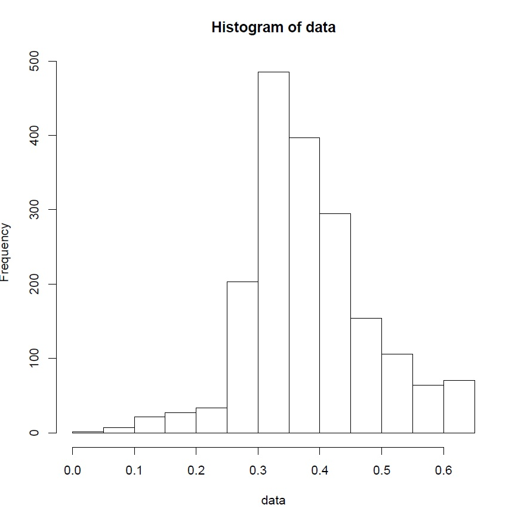
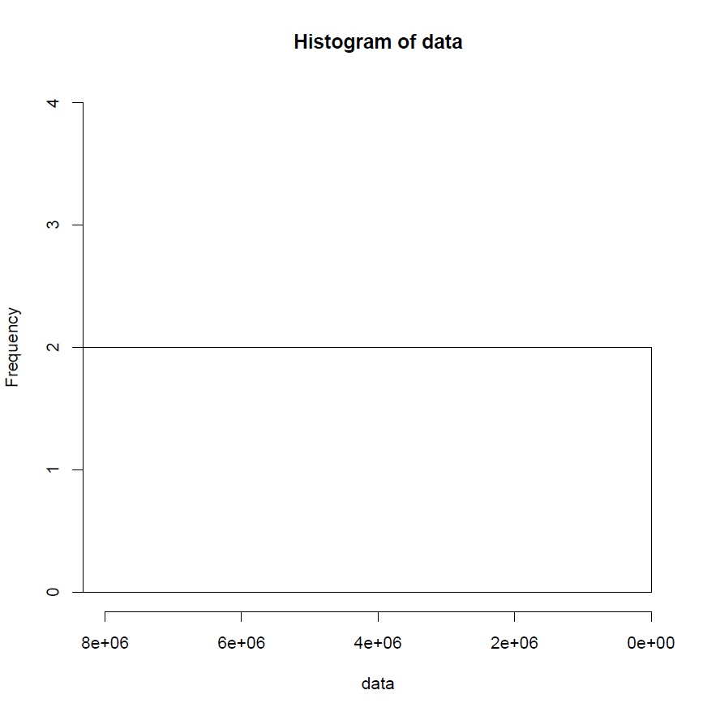
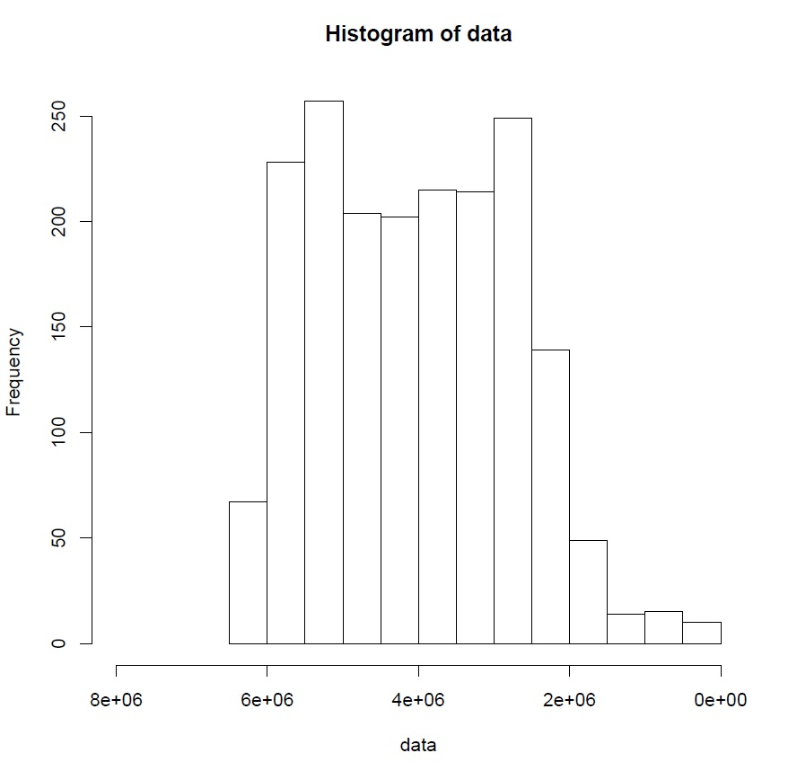
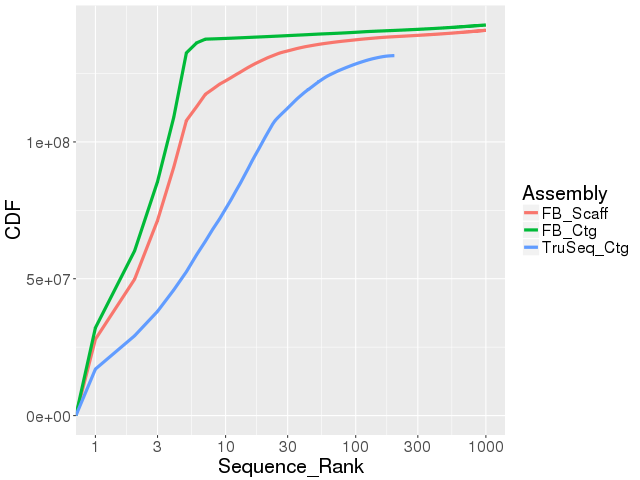

### I do not see any plots or any results. Please make sure to embed plots and images as well as provide the calculated values for the questions asked. Your code for genome assembly looks good, but you should be able to provide the results. Please update this asap.

#To intiate a bash script and loading in neccessary module

```
#!/bin/bash
module load augustus/3.2.1
module load blast/2.2.31 hmmer/3.1b2 boost/1.54.0
source /pub/jje/ee282/bin/.buscorc
module load jje/jjeutils
#mumerplot only works with gnu 4
module load gnuplot/4.6.0
module load python/2.7.15
module load perl
module load jje/jjeutils/0.1a
module load rstudio/0.99.9.9
module load R/3.4.1
module load samtools
module load jje/kent/2014.02.19
```

# first question:

download genome fasta from gly base and unzip to ref.fa:
```
wget ftp://ftp.flybase.net/genomes/Drosophila_melanogaster/dmel_r6.24_FB2018_05/fasta/*chromosome*
zcat dmel-all-chromosome-r6.24.fasta.gz > ref.fa
```
cut out all sequence that is larger than 100kb
```
bioawk -c fastx '{ if(length($seq) > 100000) { print ">"$name; print $seq }}' ref.fa > 100k.fa
```
 count all nucleotide with grep for sequence larger thant 100kb
```
grep -v "^>" 100k.fa | wc | awk '{print $3-$1}' > 100ktotalnucleotidecount.txt
```
 count all N with grep for sequence larger thant 100kb
```
grep -v "^>" 100k.fa | tr -cd N | wc -c > 100kNcount.txt
```
 sequence count with grep for sequence larger thant 100kb
```
grep -c "^>" 100k.fa > 100ksequencecount.txt
```
cut out all sequence that is smaller or equal to 100kb
```
bioawk -c fastx '{ if(length($seq) <= 100000) { print ">"$name; print $seq }}' ref.fa > s100k.fa
```
 count all nucleotide with grep for sequence that is smaller or equal to 100kb
```
grep -v "^>" s100k.fa | wc | awk '{print $3-$1}' > s100ktotalnucleotidecount.txt
```
 count all N with grep for sequence that is smaller or equal to 100kb
```
grep -v "^>" s100k.fa | tr -cd N | wc -c > s100kNcount.txt
```
 sequence count with grep for sequence that is smaller or equal to 100kb
```
grep -c "^>" s100k.fa > s100ksequencecount.txt
```
bigger than 100kb plot
```
mkdir /bio/khoih/ee282/homework4/testing/100k/
cd /bio/khoih/ee282/homework4/testing/100k/
cp /bio/khoih/ee282/homework4/testing/100k.fa /bio/khoih/ee282/homework4/testing/100k/
samtools faidx /bio/khoih/ee282/homework4/testing/100k/100k.fa
mkdir /bio/khoih/ee282/homework4/testing/100k/length/
cd /bio/khoih/ee282/homework4/testing/100k/length/
```
 sequence length distribution for sequence that is larger 100kb
```
cut -f2 /bio/khoih/ee282/homework4/testing/100k/100k.fa.fai \
| Rscript -e 'data <- as.numeric (readLines ("stdin")); summary(data); hist(data)'

mkdir /bio/khoih/ee282/homework4/testing/100k/gc/
cd /bio/khoih/ee282/homework4/testing/100k/gc
```
 GC content distribution for sequence that is larger 100kb
```
bioawk -c fastx '{ print $name, gc($seq) }' /bio/khoih/ee282/homework4/testing/100k/100k.fa \
> /bio/khoih/ee282/homework4/testing/100k/100kgc.txt

cut -f2 100kgc.txt | Rscript -e 'data <- as.numeric (readLines ("stdin")); summary(data); hist(data)'
```
cummulative genome size for sequence that is larger 100kb
```
mkdir /bio/khoih/ee282/homework4/testing/100k/gs/
cd /bio/khoih/ee282/homework4/testing/100k/gs/

bioawk -c fastx '{ print $name, length($seq) }' /bio/khoih/ee282/homework4/testing/100k/100k.fa \
|  awk '{print $2}' | awk '{total += $0; $0 = total}1' | sort -n -r \
| Rscript -e 'data <- as.numeric (readLines ("stdin")); summary(data); hist(data,xlim = rev(range(8000000,0)))'

```
 less than 100kb plot:
```
mkdir /bio/khoih/ee282/homework4/testing/s100k/
cd /bio/khoih/ee282/homework4/testing/s100k/

cp /bio/khoih/ee282/homework4/testing/s100k.fa /bio/khoih/ee282/homework4/testing/s100k/

samtools faidx /bio/khoih/ee282/homework4/testing/s100k/s100k.fa
mkdir /bio/khoih/ee282/homework4/testing/s100k/length/
```
 sequence length distribution for sequence that is smaller or equal to 100kb
```
cd /bio/khoih/ee282/homework4/testing/s100k/length/
cut -f2 /bio/khoih/ee282/homework4/testing/s100k/s100k.fa.fai \
| Rscript -e 'data <- as.numeric (readLines ("stdin")); summary(data); hist(data)'

mkdir /bio/khoih/ee282/homework4/testing/s100k/gc/
cd /bio/khoih/ee282/homework4/testing/s100k/gc
```
GC content distribution for sequence that is smaller or equal to 100kb:
```
bioawk -c fastx '{ print $name, gc($seq) }' /bio/khoih/ee282/homework4/testing/s100k/s100k.fa \
> /bio/khoih/ee282/homework4/testing/s100k/s100kgc.txt

cut -f2 /bio/khoih/ee282/homework4/testing/s100k/s100kgc.txt \
| Rscript -e 'data <- as.numeric (readLines ("stdin")); summary(data); hist(data)'

```
genome size for sequence that is smaller or equal to 100kb:

```
mkdir /bio/khoih/ee282/homework4/testing/s100k/gs/
cd /bio/khoih/ee282/homework4/testing/s100k/gs/

bioawk -c fastx '{ print $name, length($seq) }' /bio/khoih/ee282/homework4/testing/s100k/s100k.fa \
|  awk '{print $2}' | awk '{total += $0; $0 = total}1' | sort -n -r \
| Rscript -e 'data <- as.numeric (readLines ("stdin")); summary(data); hist(data,xlim = rev(range(8000000,0)))'

```
#assembly question:

download the reads
```
wget -O- https://hpc.oit.uci.edu/~solarese/ee282/iso1_onp_a2_1kb.fastq.gz | zcat > test.fastq
ln -sf test.fastq test.fq
```
overlap reads with minimap
```
minimap -t 32 -Sw5 -L100 -m0 test.fq{,} | gzip -1 > test.paf.gz
```
Use miniasm to construct an assembly
```
miniasm -f test.fq test.paf.gz > test.gfa

n50 () {
  bioawk -c fastx ' { print length($seq); n=n+length($seq); } END { print n; } ' $1 \
  | sort -rn \
  | gawk ' NR == 1 { n = $1 }; NR > 1 { ni = $1 + ni; } ni/n > 0.5 { print $1; exit; } '
}

awk ' $0 ~/^S/ { print ">" $2" \n" $3 } ' test.gfa \
| tee >(n50 /dev/stdin > n50.txt) \
| fold -w 60 \
> unitigs.fa

```
nucmer allignment and mumplot:

```
/bio/khoih/MUMmer3.23/nucmer -l 100 -c 100 -d 10 -banded -D 5 -prefix output ref.fa unitigs.fa
```
remove define error for mumerplot:
```
perl -i -pe 's/defined \(%/\(%/' /bio/khoih/MUMmer3.23/mummerplot
```
generate dotplot as png image :
```
/bio/khoih/MUMmer3.23/mummerplot --fat --layout --filter -p image output.delta -R ref.fa -Q unitigs.fa --png
```
contiguity plot
```
faSplitByN ../ref.fa ./ref.fa 10
wait
bioawk -c fastx ' { print length($seq) } ' ./ref.fa | sort -rn \
| awk ' BEGIN { print "Assembly\tLength\nFB_Scaff\t0" } { print "FB_Scaff\t" $1 } ' > r6scaff_fifo.txt &

bioawk -c fastx ' { print length($seq) } ' ../ref.fa | sort -rn \
| awk ' BEGIN { print "Assembly\tLength\nFB_Ctg\t0" } { print "FB_Ctg\t" $1 } ' > r6ctg_fifo.txt &

bioawk -c fastx ' { print length($seq) } ' unitigs.fa | sort -rn \
| awk ' BEGIN { print "Assembly\tLength\nTruSeq_Ctg\t0" } { print "TruSeq_Ctg\t" $1 } ' > truseq_fifo.txt &

wait

plotCDF2 {r6scaff,r6ctg,truseq}_fifo.txt r6_v_truseq.png
```


#Busco score calculation:
```
INPUTTYPE="geno"
MYLIBDIR="/pub/jje/ee282/bin/busco/lineages/"
MYLIB="diptera_odb9"
OPTIONS="-l ${MYLIBDIR}${MYLIB}"
QRY="unitigs.fa"
MYEXT=".fa"

python /pub/jje/ee282/bin/busco/BUSCO.py -c 1 -i ${QRY} -m ${INPUTTYPE} \
-o $(basename ${QRY} ${MYEXT})_${MYLIB}${SPTAG} ${OPTIONS}

```


# Question 1 results:

## Calculate the following for all sequences ≤ 100kb and all sequences > 100kb:
fileformat: 100k-prefix is for all sequences bigger than 100k and s100k-prefix is for all sequences smaller or equal to 100k:
  Total number of nucleotides : 
     
     100ktotalnucleotidecount :137547960
     
     s100ktotalnucleotidecount :6178042
  
  Total number of Ns: 
     
     100kNcount : 490385
     
     s100kNcount : 662593
  
  Total number of sequences : 
      
      100ksequencecount: 7
      
      s100ksequencecount: 1863

## Plots of the following for the whole genome, for all sequences ≤ 100kb, and all sequences > 100kb:
fileformat: 100k-prefix is for all sequences bigger than 100k and s100k-prefix is for all sequences smaller or equal to 100k:

  Sequence length distribution: 
  
  100klength
  
  
  s100klength
  
 
  Sequence GC% distribution:
  
  100kgc
  
  s100kgc
    
  Cumulative genome size sorted from largest to smallest sequences: 
  100kgs
  
  s100kgs
  

# Assembly assessment

comparison of n50 : n50comparison.txt:

   from constructed assembly : n50 = 4494246

   from reference assembly : scaffold n50 = 25,286,936 and contig n50 = 21,485,538

Compare your assembly to the contig assembly (not the scaffold assembly!) from Drosophila melanogaster on FlyBase using a dotplot constructed with MUMmer (Hint: use faSplitByN as demonstrated in class) : 


Compare your assembly to both the contig assembly and the scaffold assembly from the Drosophila melanogaster on FlyBase using a contiguity plot (Hint: use plotCDF2 as demonstrated in class and see this example): 



Calculate BUSCO scores of both assemblies and compare them : 

Full result can be found in full_table_unitigs_diptera_odb9.tsv

first 4 busco score 
| Busco id    |	Status     |	Contig     |	Start   |	End     |	Score    |	Length| 
| :---------: | :--------: | :--------: | :-----: | :-----: | :------: | :---: |
| EOG0915001T |	Fragmented |	utg000028l |	1791386 |	1802091 |	177.0	496|
| EOG0915002S |	Fragmented |	utg000033l |	1224323 |	1228239 |	240.7	254|
| EOG0915003K |	Fragmented |	utg000002l |	16479577|	16486864|	96.2	190 |
| EOG091500CY |	Fragmented |	utg000034l |	126097  |	136703  |	116.9	335|

short summary of busco:

C:0.3%[S:0.3%,D:0.0%],F:1.6%,M:98.1%,n:2799
| 8       | Complete BUSCOs (C) |
| 8       | Complete and single-copy BUSCOs (S) |
| 0       | Complete and duplicated BUSCOs (D) |
| 44      | Fragmented BUSCOs (F) |
| 2747    | Missing BUSCOs (M) |
| 2799    | Total BUSCO groups searched |

